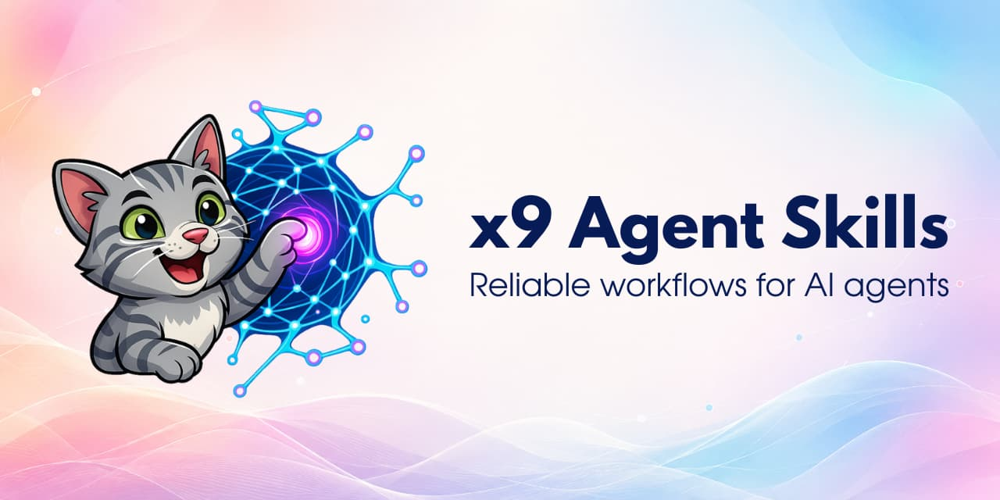

<p align="center">
  
</p>

<p align="center">
  Language: <strong>English</strong> · <a href="README.ru.md">Русский</a>
</p>

# x9 Agent Skills

[](https://skills.sh/xonika9/agent-skills)
[](https://github.com/xonika9/agent-skills/actions/workflows/validate.yml)
[](https://github.com/xonika9/agent-skills/releases/latest)

Practical [Agent Skills](https://agentskills.io/) for work that rarely fits into one prompt: source-backed research, controlled browser sessions, skeptical idea review, and reliable multi-step workflows.

- Verify current claims instead of trusting model memory.
- Keep authenticated browser work predictable and separate from your own tabs.
- Give long-running agent workflows checkpoints, stop conditions, and evidence.

The `x9-` prefix keeps the skills easy to find and avoids collisions with similarly named packages. In Claude Code or Codex, type `/x9` to see the installed plugin skills.

> I share field notes on AI models and developer tools in [Контролируемые галлюцинации](https://t.me/+DOZWlhI4r4EyYjgy), a Russian-language Telegram channel.

## Install

Start with the interactive installer. It lets you choose the skills, target agents, and installation scope:

```bash
npx skills add xonika9/agent-skills
```

Some workflows compose multiple skills. If you install selectively, choose the companion skills named in the catalog as well; the installer does not resolve those relationships automatically.

Want to inspect the catalog first?

```bash
npx skills add xonika9/agent-skills --list
```

If you want the complete package as a managed plugin, use the native route for your agent.

<details>
<summary><strong>Claude Code plugin</strong></summary>

```bash
claude plugin marketplace add xonika9/agent-skills
claude plugin install x9-agent-skills@xonika9
```

Skills use the plugin namespace, for example `/x9-agent-skills:x9-research`.

</details>

<details>
<summary><strong>Codex plugin</strong></summary>

```bash
codex plugin marketplace add xonika9/agent-skills
codex plugin add x9-agent-skills@xonika9
```

</details>

Clone or fork the repository only when you want to maintain your own variants. You will then need to merge upstream changes yourself.

## Compatibility

The skills use the open Agent Skills format and are packaged for Claude Code and Codex. Most also work in other compatible agents. Runtime-specific exceptions are stated in the catalog and inside each skill.

## Where to start

You do not need to learn the whole package first. Pick the problem that sounds familiar:

- The agent answers from memory or skims the topic: start with [`x9-research`](skills/x9-research/SKILL.md).
- The task depends on your login, region, feed, cart, or private pages: add [`x9-browser-session`](skills/x9-browser-session/SKILL.md).
- You are choosing a product on Wildberries: use [`x9-wb-product-search`](skills/x9-wb-product-search/SKILL.md).
- You want an idea challenged before investing in it: call [`x9-idea-critic`](skills/x9-idea-critic/SKILL.md).
- You need a strong prompt, or a second look at instructions you already wrote: use [`x9-agent-instructions`](skills/x9-agent-instructions/SKILL.md).
- A new or existing repository needs `AGENTS.md` and `CLAUDE.md`: run [`x9-context-files-generator`](skills/x9-context-files-generator/SKILL.md).
- You keep repeating the same multi-stage workflow by hand: design it with [`x9-loop-engineering`](skills/x9-loop-engineering/SKILL.md).
- You want to turn a process into a skill, or audit a skill you already have: use [`x9-skill-creator`](skills/x9-skill-creator/SKILL.md).
- You need an editable diagram in Excalidraw, Mermaid, or draw.io: use [`x9-diagrams`](skills/x9-diagrams/SKILL.md).
- You work in Claude Code but want Codex to take a bounded part of the job: use [`x9-codex-delegation`](skills/x9-codex-delegation/SKILL.md).
- Your Markdown documentation has grown into a knowledge base: adapt it with [`x9-okf-docs`](skills/x9-okf-docs/SKILL.md).

## Skill catalog

### Research and personal browser automation

#### [`x9-research`](skills/x9-research/SKILL.md)

Agents often produce a plausible answer from memory and call it research. This skill makes them open current sources, trace the claims that carry the conclusion, look for counter-evidence, and say what could not be verified. X/Twitter is inspected through your authenticated browser; Reddit and forums are used for lived experience, not treated as proof.

Plain research requests stay in chat. Ask to save the work or create it in a folder and the skill writes a Markdown work file inside the matching long-lived `docs/research/` subject area. Ask to update research and it resolves the existing file through OKF frontmatter, refreshes its evidence, and automatically synchronizes a same-basename HTML presentation when one already exists. Explicitly requesting HTML creates or updates that reader-facing companion beside the Markdown file; the two formats share an identity but not the same composition. Browser work is routed through `x9-browser-session`.

#### [`x9-browser-session`](skills/x9-browser-session/SKILL.md)

A clean automation browser is enough to test a public website. It is the wrong tool for a personal task where your account, region, saved data, or feed changes the result. This skill chooses between a connector, a clean browser, and a dedicated authenticated Chromium profile, then works in its own tab without taking over yours.

The [setup guide](skills/x9-browser-session/references/setup.md), which you can hand directly to an agent, includes a tested Edge/macOS adapter and the portable Chromium/CDP contract behind it. Both runtimes use their in-app browser for local web development and explicit in-app requests unless the target appears in the skill's extensible MCP allowlist. Allowlisted domains, currently `avito.ru`, use `chrome-devtools` MCP in both runtimes and bypass the browser extension. Other Codex browser work defaults to its Edge extension; other Claude Code browser work defaults to MCP. Both reserve `agent-edge` for unattended fallback.

Avito browsing uses one sequential lane across the parent task: the agent reuses captured listing data, passively rechecks a transient security interstitial once after five seconds, and stops with `DEGRADED` instead of switching controllers when throttling or access controls persist.

#### [`x9-wb-product-search`](skills/x9-wb-product-search/SKILL.md)

A Wildberries rating rarely tells the whole story: reviews may belong to another variant, the seller may be questionable, and the visible price depends on the account and region. This skill searches through your logged-in session, checks the exact variant, seller, price per unit, fresh and low-rated reviews, recurring risks, and buyer photos when appearance or packaging matters before producing a shortlist.

It is deliberately Wildberries-specific and runs inside the current Claude Code or Codex session. Install `x9-browser-session` with it.

### Ideas and agent behavior

#### [`x9-idea-critic`](skills/x9-idea-critic/SKILL.md)

Use this when you want resistance, not another enthusiastic brainstorm. The skill sends a neutral brief to independent Opus and GPT critics. The main agent then combines agreements, disagreements, fatal assumptions, cheaper alternatives, and the quickest tests that could prove the idea wrong.

It also turns the upheld findings into a self-contained stronger proposal and maps every material change back to the problem it addresses. The default uses one critic from each provider; focused and deeper panel modes are also available. The GPT route from Claude Code uses `x9-codex-delegation`.

#### [`x9-agent-instructions`](skills/x9-agent-instructions/SKILL.md)

This is the skill for “write me a prompt for this task.” Describe the outcome in your own words, including through speech-to-text, and it turns that input into a bounded brief with the goal, constraints, evidence, authority, deliverable, and completion bar.

It also reviews prompts and agent instructions you already have — any file that holds them, global `AGENTS.md` and `CLAUDE.md` included. The first pass is report-only: every retained change gets a short explanation of the practical benefit and any material trade-off, followed by the smallest complete proposed diff. It edits only after explicit approval. The underlying idea is simple: capable models need the task described in full and clear success criteria, not a script telling them which steps to take.

Based on:

- [Prompting best practices](https://platform.claude.com/docs/en/build-with-claude/prompt-engineering/claude-prompting-best-practices)
- [Prompting Claude Fable 5](https://platform.claude.com/docs/en/build-with-claude/prompt-engineering/prompting-claude-fable-5)
- [Prompting Claude Opus 5](https://platform.claude.com/docs/en/build-with-claude/prompt-engineering/prompting-claude-opus-5)
- [The new rules of context engineering for Claude 5 generation models](https://claude.com/blog/the-new-rules-of-context-engineering-for-claude-5-generation-models)
- [Using GPT-5.6](https://developers.openai.com/api/docs/guides/latest-model?model=gpt-5.6)

### Visual artifacts

#### [`x9-diagrams`](skills/x9-diagrams/SKILL.md)

Choosing the diagram type and choosing its file format are different decisions. This skill first identifies the relationship the visual must explain, then selects Excalidraw, Mermaid, or draw.io from the delivery constraints. The shared method controls the question, audience, reading direction, hierarchy, density, boundaries, labels, routing, and the point where one overloaded diagram should split.

Each route produces native editable source: `.excalidraw` JSON with checked bindings and current fonts, Mermaid text validated by the target renderer, or `.drawio` XML with pages, layers, containers, geometry, and resolvable connections. Structural validity and visual quality are separate gates, so completion requires a compatible render or editor inspection; unavailable native proof is reported as `DEGRADED`.

### Repositories and reusable workflows

#### [`x9-context-files-generator`](skills/x9-context-files-generator/SKILL.md)

On a new repository, it creates useful `README.md`, `AGENTS.md`, and `CLAUDE.md` files. On an existing codebase, it reads the real commands, structure, CI, and local constraints before updating them, so the result does not become a generated file tree or a pile of advice the agent could infer itself.

For personal cross-runtime repositories, `AGENTS.md` stays the source of truth and `CLAUDE.md` imports it with `@AGENTS.md`. Claude Code and AGENTS-aware harnesses receive the same context without two copies drifting apart.

For agent-facing prose, it loads `x9-agent-instructions` as a required companion rubric instead of copying prompt-quality rules. The full plugin already includes both skills; install them together when copying `x9-context-files-generator` individually. Without the companion, repository and structural checks continue, but agent-file instruction quality is reported as degraded. README-only work does not require it.

#### [`x9-skill-creator`](skills/x9-skill-creator/SKILL.md)

Give it an already understood repeated process to package as an Agent Skill, or hand it an existing skill for an audit. When the idea is underspecified, it asks only the questions that change the design. It then builds or fixes the trigger contract, structure, references, runtime adapters, safety boundaries, and validation. If the process is a multi-stage autonomous loop, design that loop with `x9-loop-engineering` first.

The method applies one cross-runtime quality contract to Claude Code and Codex skills. Structural validation uses explicit portable, Claude Code, and Codex profiles, so a passing check names the compatibility it actually proved. The skill supports both static audits and clean-context behavioral evaluation when the extra evidence is worth the cost.

For agent-facing instruction prose, it loads `x9-agent-instructions` as a required companion rubric instead of copying those rules. The full plugin already includes both skills; install them together when copying individual skills. Without the companion, structural checks remain available, but the instruction-quality part of Create, Audit, and Fix is reported as degraded.

Persistent audit reports under `docs/skill-audits/` use the language the user explicitly requests. Without an override, they follow the audit request's primary language, then the current conversation language when the request itself is ambiguous.

#### [`x9-loop-engineering`](skills/x9-loop-engineering/SKILL.md)

Some jobs repeat the same cycle: explore, plan, work, review, revise, and preserve what was learned. Instead of manually feeding the next prompt every time, this skill designs a bounded agent loop with durable state, decision rights, checkpoints, stop conditions, recovery, and honest degraded outcomes.

Once the loop has been validated, `x9-skill-creator` can package it as one reusable skill. The resulting workflow is designed to run without constant prompt-feeding while keeping its authority and stopping conditions bounded; the actual runner still depends on the target runtime.

#### [`x9-codex-delegation`](skills/x9-codex-delegation/SKILL.md)

This narrow bridge lets Claude Code hand a substantial, well-scoped task to Codex and verify the real diff or evidence afterward. It is useful when Codex is a better fit for one part of the work, and it helps spread work across subscription limits.

The skill is Claude Code only. It does not manage quotas by itself and does not delegate trivial work just to add another agent.

### Knowledge bases

#### [`x9-okf-docs`](skills/x9-okf-docs/SKILL.md)

Large Markdown documentation collections become easier for people and agents to navigate when every document describes itself consistently. This skill maintains a knowledge base under [OKF v0.2](https://github.com/GoogleCloudPlatform/knowledge-catalog/blob/main/okf/SPEC.md), keeps repository instructions version-independent, and upgrades only the documents being substantively edited. On the first OKF write in an older repository, it also replaces copied version rules or the former `x9-okf-adapt` name in `AGENTS.md`.

The main skill file is a short route selector, so routine edits load only the maintenance contract. Adoption, repair, and bulk migration live in separate references. Legacy v0.1 collections keep working without a forced repository-wide migration, and deterministic scripts verify that document bodies, line endings, and BOMs did not change.

## Global instruction files

The repository carries separate ready-to-install global files for [OpenCode](global-files/opencode/AGENTS.md), [Codex](global-files/codex/AGENTS.md), and [Claude Code](global-files/claude/CLAUDE.md). They share the same personal core while keeping each harness adapter separate. They cover language preferences, authority boundaries, preservation, uncertainty, observable completion, documentation and browser routing, and tested subagent behavior. Machine-specific installation paths are intentionally replaced with skill discovery by name.

Treat them as examples, not as files to overwrite blindly. A safe request is:

```text
Use x9-agent-instructions to review these examples and merge only the rules that fit my setup.
Preserve my existing instructions, paths, tools, and repository-specific sections.
```

## Updates

Update one globally installed skill:

```bash
npx skills update x9-research -g
```

Update all globally installed skills:

```bash
npx skills update -g
```

Plugin users can update through their agent's marketplace flow. Review [CHANGELOG.md](CHANGELOG.md) before adopting a new version if your workflows depend on runtime-specific behavior.

## Contributing and security

Bug reports, focused skill improvements, and reproducible compatibility findings are welcome. Before release, CI validates every skill, plugin metadata, regression tests, and public files. Read [CONTRIBUTING.md](CONTRIBUTING.md) before opening a pull request. For vulnerabilities or sensitive reports, follow [SECURITY.md](SECURITY.md) instead of creating a public issue. Community conduct is covered by the [Code of Conduct](CODE_OF_CONDUCT.md).

If this package saves you time, [star the repository](https://github.com/xonika9/agent-skills) so more people can find it. For new experiments and practical notes, follow [Контролируемые галлюцинации](https://t.me/+DOZWlhI4r4EyYjgy).

## License

[MIT](LICENSE). Use individual skills, adapt them, or assemble your own package.
