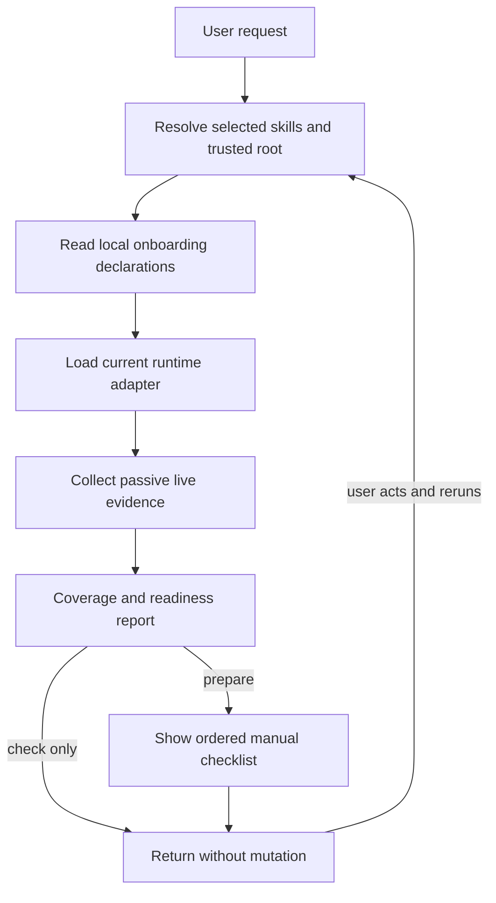

# X9 Onboarding - Plan

## Goal Capsule

- **Objective:** После установки или обновления пользователь может определить, готовы ли выбранные `x9-*` к работе в текущей среде, и получить точные безопасные инструкции для недостающих зависимостей.
- **Means:** Новый пакетный скилл `x9-onboarding` читает локальные декларации требований, применяет read-only средовые адаптеры и подключается к существующим проверкам пакета и релиза (KTD1-KTD6).
- **Authority:** Пользовательский запрос определяет область проверки. Декларации определяют требования, а адаптер текущей среды определяет допустимые пассивные доказательства. Репозиторные правила безопасности имеют приоритет над декларацией.
- **Execution profile:** Реализация и локальная проверка без публикации, коммита, push, тега или релиза.
- **Stop conditions:** Не читать декларацию за пределами доверенного пакетного корня; завершить затронутую проверку как `BLOCKED`, если декларация невалидна, доказательство требует чтения секрета или текущая среда не имеет безопасного read-only адаптера.

---

## Product Contract

### Summary

Добавить `x9-onboarding` как явный второй этап после установки `x9-*`: он проверяет внешние зависимости выбранных скиллов, честно показывает охват и готовность и выдаёт точный список ручных действий без изменения среды.

### Problem Frame

Текущая установка переносит каталоги скиллов, но не создаёт пользовательских агентов, MCP-конфигурацию, CLI, браузерные профили и другие внешние предпосылки. README предупреждает только о связанных скиллах, поэтому установленный скилл может выглядеть готовым и затем деградировать при первом запуске.

Требования сейчас распределены по `SKILL.md`, справочникам и личным конфигам автора. Новому пользователю нужен один явный маршрут проверки, но его сопровождение не должно превращаться в центральный реестр, универсальный установщик или отдельную сложную систему контроля релизов.

### Key Decisions

- **Название `x9-onboarding`** (session-settled: user-directed — chosen over `x9-setup`: onboarding точнее описывает весь путь после установки). Governs R1, R2.
- **Требования принадлежат конкретному скиллу** (session-settled: user-directed — chosen over a central requirements registry: локальное владение уменьшает стоимость сопровождения). Governs R3, R4, R12.
- **Только рабочие зависимости** (session-settled: user-approved — chosen over merging global instruction files: глобальные личные правила не нужны для работоспособности скилла). Governs R10.
- **Read-only первая версия** (session-settled: user-directed — chosen after repository review found no real dependency-preparation operation inside the agreed safety boundary: версия 1 проверяет и объясняет, но ничего не изменяет). Governs R7-R11.

### Requirements

**Пользовательский маршрут**

- R1. Метаданные `x9-onboarding` срабатывают на явную просьбу проверить или подготовить зависимости установленных `x9-*` после установки или обновления.
- R2. Метаданные не срабатывают на обычную установку плагина, произвольную диагностику среды, настройку OAuth или редактирование глобальных инструкций.
- R3. Пользователь может назвать один или несколько скиллов явно; автоматическое обнаружение допускается только через активный каталог среды и физический корень загруженного `x9-onboarding`. Явный внешний путь не становится доверенным: его декларация не читается, а цель получает `PARTIAL` + `BLOCKED` с причиной.
- R4. Для каждого доверенного выбранного скилла `x9-onboarding` читает `references/onboarding.json`, если файл существует; отсутствие файла означает отсутствие задекларированных внешних требований, а не разрешение эвристически извлекать их из прозы.

**Проверка и отчёт**

- R5. Отчёт разделяет охват проверки (`COMPLETE`, `PARTIAL`, `EXPLICIT`) и состояние требования (`READY`, `NEEDS_SETUP`, `USER_ACTION`, `PENDING_RESTART`, `BLOCKED`).
- R6. Каждая строка отчёта называет выбранный скилл, возможность, источник декларации, минимальное безопасное доказательство, недостающую предпосылку и следующий безопасный шаг. Сырые конфиги, вывод процессов, значения окружения, credentials и URL с токенами не попадают в отчёт или диагностику.
- R7. Запрос на проверку остаётся read-only и не запускает авторизацию, браузерный профиль, установщик, перезапуск среды или другую изменяющую операцию.

**Инструкции и полномочия**

- R8. Запрос на подготовку формирует единый упорядоченный список ручных действий и ожидаемых доказательств, но не выполняет команды и не изменяет файлы или внешнее состояние.
- R9. Декларация не содержит исполняемых команд, аргументов оболочки, произвольных путей, URL действий или текста, который агент должен трактовать как инструкцию. Решения выводятся только из закрытых идентификаторов схемы и статических таблиц адаптера.
- R10. OAuth, credentials, cookies, платный провайдер, браузерный профиль или расширение, общий пользовательский конфиг и глобальные `AGENTS.md`/`CLAUDE.md` всегда остаются `USER_ACTION`; версия 1 не изменяет и остальные поверхности.
- R11. Обнаруженная настройка, которую текущий процесс не может подхватить без новой сессии, получает `PENDING_RESTART`; только повторная проверка в новой сессии может перевести её в `READY`.

**Сопровождение пакета**

- R12. Скилл с внешними предпосылками хранит их в собственном `references/onboarding.json`; скилл без таких предпосылок не обязан иметь пустую декларацию.
- R13. Детерминированная проверка отклоняет невалидную схему, неизвестные поля и типы, дубли идентификаторов, произвольные команды, небезопасные пути, секретоподобные значения, недопустимый свободный текст и ссылки на отсутствующие пакетные скиллы.
- R14. Релизный процесс смыслово сверяет каждый изменённый `SKILL.md`, достижимый справочник и добавленную, изменённую или удалённую декларацию с локальным контрактом требований, но не вводит хеши, центральный реестр или автоматическое извлечение зависимостей из свободного текста.
- R15. Английский и русский README описывают двухэтапную установку, границы автоматизации и выборочную установку `x9-onboarding`; `CHANGELOG.md` фиксирует пользовательский результат.

### Key Flows

- F1. **Проверка готовности**
  - **Trigger:** Пользователь просит проверить выбранные или доступные `x9-*`.
  - **Steps:** Разрешить источник и область охвата; прочитать доверенные декларации; выполнить пассивные проверки; вывести два измерения статуса и доказательства.
  - **Outcome:** Пользователь видит честный отчёт без изменений среды.
  - **Covered by:** R3-R7.
- F2. **Инструкции по подготовке**
  - **Trigger:** Пользователь просит подготовить зависимости.
  - **Steps:** Выполнить F1; сгруппировать недостающие требования; показать упорядоченные ручные действия, границы полномочий и ожидаемые доказательства; предложить повторную проверку после действий пользователя.
  - **Outcome:** Пользователь получает исполнимый чек-лист, а перезапуск или ручная граница не выдаются за завершённую настройку.
  - **Covered by:** R7-R11.
- F3. **Сопровождение при релизе**
  - **Trigger:** Релизный скилл анализирует изменения с последнего публичного тега.
  - **Steps:** Найти изменённые инструкции; проверить новые или удалённые внешние предпосылки; обновить декларацию либо зафиксировать отсутствие влияния; запустить структурную проверку.
  - **Outcome:** Пакет не выпускается с заведомо устаревшей декларацией.
  - **Covered by:** R12-R15.

### Acceptance Examples

- AE1. **Covers R3-R7.** Given пользователь явно выбрал `x9-opencode-sessions`, when `opencode2` отсутствует, then охват указан честно, требование получает не `READY`, а статус с доказательством отсутствия и следующим шагом.
- AE2. **Covers R3-R6.** Given каталог активных скиллов недоступен, when пользователь не назвал цели, then `x9-onboarding` не сканирует произвольные `x9-*`, сообщает `PARTIAL` и просит явный список.
- AE3. **Covers R7-R10.** Given декларация требует авторизованный профиль Wildberries, when выполняется проверка или подготовка, then профиль не открывается и не читается, а требование получает `EXPLICIT` + `USER_ACTION`.
- AE4. **Covers R8-R10.** Given отчёт обнаружил отсутствующий CLI и ручную авторизацию, when пользователь просит подготовку, then скилл показывает два раздельных ручных шага с ожидаемыми доказательствами и не запускает установщик, браузер или редактор конфигурации.
- AE5. **Covers R9-R11.** Given конфигурация существует на диске, но загружается только при старте среды, when текущая сессия не видит возможность, then результат `PENDING_RESTART`, а не `READY` и не попытка перезапуска.
- AE6. **Covers R12-R14.** Given изменённый справочник добавил новый обязательный CLI, when готовится релиз, then релизный аудит требует обновить локальный `onboarding.json` или явно обосновать отсутствие новой предпосылки.

### Success Criteria

- Чистый контекст корректно запускает `x9-onboarding` по положительному запросу и не запускает его по near-miss запросам из R2.
- Для каждого первоначально охваченного скилла отчёт не заявляет готовность без требуемого доказательства.
- Ни один путь проверки или подготовки не изменяет запрещённые в R10 поверхности.
- Новая декларация с запрещённым полем или действием блокирует CI воспроизводимым сообщением.
- Запрос на подготовку не выполняет ни одного шага из выданного чек-листа.

### Scope Boundaries

#### Deferred to Follow-Up Work

- Интеграция с post-install hook установщика, если `npx skills` или нативные плагины предоставят подтверждённый lifecycle hook и список выбранных скиллов.
- Автоматическое применение после отдельного выбора реальной операции и доказательства её идемпотентности, восстановления и поведения при перезапуске.

#### Outside This Work

- Автоматическая установка OpenCode, Claude Code, Codex, сторонних CLI, пакетов или браузерных расширений.
- Авторизация, ввод или хранение учётных данных, выбор платного провайдера и управление браузерными профилями.
- Установка или объединение глобальных файлов инструкций.
- Любой редактор JSON, JSONC, TOML или другого пользовательского конфига.
- Центральный реестр требований, хеш-аттестации инструкций и эвристический анализ свободного текста в CI.

---

## Planning Contract

### Key Technical Decisions

- KTD1. **Локальная декларация с закрытой схемой.** `references/onboarding.json` хранит стабильный идентификатор требования, применимые среды, требуемую возможность, уровень обязательности, тип пассивной проверки и условную цель проверки. Схема не принимает команды, URL действий, переменные окружения с данными, произвольные пути или неограниченный текст. (session-settled: user-directed — chosen over a central registry: each skill remains the owner of its setup contract.) Supports R3, R4, R9, R12, R13.
- KTD2. **Доверие определяется происхождением, а не префиксом или явным выбором.** Читаются только декларации активных скиллов, чей разрешённый физический путь остаётся внутри того же пакетного `skills/` root, что и загруженный `x9-onboarding`. Явно выбранный внешний путь остаётся видимым, но его содержимое не читается и не влияет на решения. Supports R3-R6.
- KTD3. **Охват и готовность независимы.** `COMPLETE/PARTIAL/EXPLICIT` описывают доказательность проверки, а `READY/NEEDS_SETUP/USER_ACTION/PENDING_RESTART/BLOCKED` описывают состояние требования. `EXPLICIT` не означает выполненное требование, а `PARTIAL` не может агрегироваться в ложный общий `READY`. Supports R5, R6, R11.
- KTD4. **Средовые факты принадлежат тонким read-only адаптерам.** Общий `SKILL.md` определяет жизненный цикл, полномочия и отчёт. Справочники OpenCode, Claude Code и Codex определяют, как пассивно проверить живой каталог, CLI, MCP и runtime-возможности. Неподдерживаемая среда получает `PARTIAL` + `BLOCKED` с причиной отсутствия адаптера. Supports R5-R11.
- KTD5. **Версия 1 не хранит и не применяет планы.** Чек-лист строится из свежей проверки в текущем диалоге; после ручных действий пользователь запускает новую проверку. Это исключает устаревшее подтверждение и отдельное lifecycle-хранилище. (session-settled: user-directed — chosen after no safe in-scope preparation operation was found.) Supports R8-R11.
- KTD6. **Пакетная и смысловая проверки разделены.** Новый детерминированный скрипт проверяет существующие декларации и их ссылки. Релизный скилл владеет смысловой сверкой изменённых инструкций. Общий валидатор Agent Skills продолжает проверять структуру и достижимость ресурсов, не превращаясь в реестр правил `x9-onboarding`. Supports R12-R15.

### High-Level Technical Design

Декларация остаётся данными. Общий скилл выбирает маршрут, адаптер получает живые доказательства, а пользовательская граница контролирует любое действие.



Состояние требования не смешивается с полнотой наблюдения:

```mermaid
stateDiagram-v2
  [*] --> READY: evidence passes
  [*] --> NEEDS_SETUP: safe supported action exists
  [*] --> USER_ACTION: human boundary
  [*] --> BLOCKED: unsafe, invalid, or unknowable
  NEEDS_SETUP --> USER_ACTION: manual boundary reached
  NEEDS_SETUP --> PENDING_RESTART: user changed setup; reload required
  NEEDS_SETUP --> READY: rerun evidence passes
  PENDING_RESTART --> READY: new-session evidence passes
  PENDING_RESTART --> BLOCKED: new-session evidence fails
  BLOCKED --> NEEDS_SETUP: blocker resolved and safe action found
```



### Declaration Contract

Минимальная схема версии 1 использует закрытый набор полей и типизированные проверки. Точная JSON-грамматика принадлежит `skills/x9-onboarding/references/declarations.md` и проверяющему скрипту. План не фиксирует исполняемые команды или быстро меняющиеся CLI-флаги.

Каждое требование должно выражать:

- стабильный `id` внутри скилла;
- список `runtimes` из поддерживаемого набора;
- `kind` из закрытого набора `skill`, `command`, `agent`, `mcp`, `runtime-feature`, `user-action`;
- `level` как `required` или `optional`;
- `needed_for` как короткая однострочная подпись до 160 символов из букв, цифр, пробелов и ограниченной пунктуации; поле всегда отображается как данные и не определяет поведение;
- типизированный `check` из закрытого набора: `skill-present` с `target_skill`, `command-present` с одним именем исполняемого файла без аргументов, `runtime-component` с известным адаптеру `component_id`, `runtime-feature` с известным адаптеру `feature_id` либо `manual` без параметров;
- условную цель, обязательную только для соответствующего `check`; `target_skill` использует `x9-` hyphen-case и разрешается относительно исходного пакетного `skills/` root;
- `guidance_id` из статической таблицы адаптера; человекочитаемые действия не приходят из декларации.

Все объекты закрыты для неизвестных полей. Адаптер возвращает только структурированное доказательство из allowlist-полей; перед отчётом значения проходят рекурсивное удаление credential-подобных ключей, bearer-токенов, query secrets и значений окружения. Если факт нельзя получить без сырого пользовательского конфига или секрета, проверка возвращает `EXPLICIT` + `USER_ACTION`.

### Sequencing

Сначала установить контракт декларации и статусную модель. Затем реализовать новый скилл и его адаптеры. После этого добавить реальные декларации существующим скиллам, подключить проверки и только затем обновить публичную документацию и релизный контракт.

---

## Output Structure

```text
skills/x9-onboarding/
├── SKILL.md
├── references/
│   ├── declarations.md
│   ├── opencode.md
│   ├── claude-code.md
│   └── codex.md
└── scripts/
    ├── validate_onboarding.py
    └── test_validate_onboarding.py
```

Скиллы с внешними предпосылками дополнительно получают `references/onboarding.json` и короткую ссылку на него из собственного `SKILL.md`, чтобы ресурс оставался достижимым для существующего структурного валидатора.

---

## Implementation Units

### U1. Define the onboarding declaration contract

- **Goal:** Создать закрытый переносимый формат требований и детерминированную проверку без внешних Python-зависимостей.
- **Requirements:** R4, R9, R12, R13.
- **Dependencies:** None.
- **Files:**
  - `skills/x9-onboarding/references/declarations.md`
  - `skills/x9-onboarding/scripts/validate_onboarding.py`
  - `skills/x9-onboarding/scripts/test_validate_onboarding.py`
- **Approach:**
  1. Описать версию 1, закрытые объекты и перечисления, условные цели каждого типа проверки, ограничения свободного текста и запрет произвольного выполнения.
  2. Проверять каждый найденный `skills/*/references/onboarding.json`, но не требовать пустой файл от скилла без внешних предпосылок.
  3. Проверять ссылки на пакетные скиллы относительно исходного `skills/` root и выдавать путь плюс поле в каждом сообщении об ошибке.
  4. Не добавлять JSON Schema и стороннюю библиотеку: одна реализация правил в Python остаётся канонической, а справочник описывает её для авторов.
- **Patterns to follow:** `skills/x9-skill-creator/scripts/validate.py` для строгой проверки и диагностик; `skills/x9-skill-creator/scripts/test_validate.py` для временных положительных и отрицательных сценариев.
- **Test scenarios:**
  - Минимальная валидная декларация с одним `command-present`-требованием без аргументов проходит.
  - Декларация с несколькими средами и необязательным связанным скиллом проходит.
  - Неизвестная версия, поле, `kind`, `level`, `runtime`, `check`, `component_id`, `feature_id` или `guidance_id` падает с точным путём поля.
  - Повторяющийся `id`, отсутствующий пакетный скилл и нестроковое значение падают.
  - Поля с командой оболочки, аргументами выполнения, внешним URL, абсолютным путём, управляющими символами, превышенной длиной или секретоподобным ключом падают.
  - Скилл без `onboarding.json` не считается ошибкой.
- **Verification:** Новый тестовый скрипт проходит на фикстурах, а валидатор принимает все декларации репозитория и отклоняет каждый запрещённый класс.

### U2. Create the x9-onboarding skill and read-only runtime adapters

- **Goal:** Реализовать пользовательский маршрут проверки и ручного чек-листа с честным охватом, статусами и полномочиями.
- **Requirements:** R1-R11.
- **Dependencies:** U1.
- **Files:**
  - `skills/x9-onboarding/SKILL.md`
  - `skills/x9-onboarding/references/opencode.md`
  - `skills/x9-onboarding/references/claude-code.md`
  - `skills/x9-onboarding/references/codex.md`
- **Approach:**
  1. Основной файл владеет триггерами, near-miss, выбором режима, доверием к источнику, двумя измерениями статуса и общими запретами по KTD2-KTD5.
  2. Каждый адаптер владеет только живым обнаружением своей среды, пассивными проверками, статической таблицей `guidance_id` и минимальным безопасным форматом доказательства.
  3. Любое чтение декларации вне канонического пакетного root запрещено даже после явного выбора. Неизвестный runtime, компонент или факт без безопасного read-only интерфейса завершается честной деградацией, а не догадкой.
  4. Перед формированием отчёта рекурсивно удалить секреты и credential-подобные данные. Не читать сырой общий конфиг ради доказательства, если адаптер не может получить минимальный структурированный факт.
  5. Не создавать постоянный журнал или план. Отчёт текущего диалога содержит только очищенные доказательства и остаточные ручные шаги; повторная проверка начинается со свежего состояния.
- **Patterns to follow:** `skills/x9-opencode-sessions/SKILL.md` для preview-first полномочий и неопределённого результата; `skills/x9-browser-session/SKILL.md` для live discovery и честной деградации; `skills/x9-skill-creator/SKILL.md` и `skills/x9-agent-instructions/SKILL.md` для структуры и качества инструкций.
- **Test scenarios:**
  - Положительный запрос после установки запускает `x9-onboarding`; запрос установить плагин или отредактировать глобальный `AGENTS.md` не запускает его.
  - Явно выбранный доверенный скилл с выполненными требованиями получает `COMPLETE` + `READY` с доказательством.
  - Недоступный каталог активных скиллов без явных целей получает `PARTIAL`, не сканируя произвольные одноимённые каталоги.
  - Внешний симлинк или явно выбранный каталог за пределами пакетного root не читается и получает `PARTIAL` + `BLOCKED` с причиной.
  - Неподдерживаемый совместимый runtime получает `PARTIAL` + `BLOCKED` с причиной отсутствия адаптера, а не отсутствие зависимости.
  - OAuth, профиль браузера и платный провайдер получают `EXPLICIT` + `USER_ACTION` без попытки чтения или изменения.
  - Запрос проверки не меняет файлы или внешнее состояние.
  - Запрос подготовки показывает упорядоченный ручной чек-лист и не выполняет ни одного действия.
  - Настройка, требующая новой сессии, получает `PENDING_RESTART`; повторная проверка в новой сессии переводит её в `READY` только по живому доказательству.
  - Проверка MCP-конфигурации с bearer-токеном возвращает только allowlist-факт без токена, URL query и сырых полей.
  - Недоступное или неопределённое доказательство не вызывает повтор или изменяющую операцию.
- **Verification:** Структурная проверка проходит в заявленных runtime-профилях; чистоконтекстная поведенческая матрица подтверждает trigger, near-miss, границу полномочий, деградацию и наблюдаемый отчёт.

### U3. Declare the current package requirements

- **Goal:** Перенести фактические внешние предпосылки из текущих инструкций в локальные декларации без дублирования быстро меняющихся команд.
- **Requirements:** R3-R6, R10-R13.
- **Dependencies:** U1, U2.
- **Files:**
  - `skills/x9-agent-instructions/SKILL.md`
  - `skills/x9-agent-instructions/references/onboarding.json`
  - `skills/x9-browser-session/SKILL.md`
  - `skills/x9-browser-session/references/onboarding.json`
  - `skills/x9-codex-delegation/SKILL.md`
  - `skills/x9-codex-delegation/references/onboarding.json`
  - `skills/x9-context-files-generator/SKILL.md`
  - `skills/x9-context-files-generator/references/onboarding.json`
  - `skills/x9-diagrams/SKILL.md`
  - `skills/x9-diagrams/references/onboarding.json`
  - `skills/x9-idea-critic/SKILL.md`
  - `skills/x9-idea-critic/references/onboarding.json`
  - `skills/x9-okf-docs/SKILL.md`
  - `skills/x9-okf-docs/references/onboarding.json`
  - `skills/x9-opencode-sessions/SKILL.md`
  - `skills/x9-opencode-sessions/references/onboarding.json`
  - `skills/x9-research/SKILL.md`
  - `skills/x9-research/references/onboarding.json`
  - `skills/x9-skill-creator/SKILL.md`
  - `skills/x9-skill-creator/references/onboarding.json`
  - `skills/x9-wb-product-search/SKILL.md`
  - `skills/x9-wb-product-search/references/onboarding.json`
- **Approach:**
  1. Повторно проверить каждый скилл и достижимые справочники; создать декларацию только там, где внешний компонент меняет доступность заявленной возможности.
  2. Кодировать условия по возможности, а не объявлять весь компонент обязательным: например, Python для HTML-проверки, Ruby/Psych для OKF-записи, браузерный профиль для авторизованного маршрута и companion skill для полной проверки инструкций.
  3. Добавить в основной файл короткую ссылку на декларацию как на контракт `x9-onboarding`; не копировать её содержимое в prose.
  4. Удалить из списка файлов любой скилл, у которого повторный аудит не найдёт внешней предпосылки; список выше является набором кандидатов, а не требованием создать каждый JSON. Не создавать пустую декларацию ради формального покрытия.
- **Patterns to follow:** существующие `compatibility` и degraded-mode формулировки в `skills/x9-opencode-sessions/SKILL.md`, `skills/x9-okf-docs/SKILL.md`, `skills/x9-skill-creator/SKILL.md` и `skills/x9-context-files-generator/SKILL.md`.
- **Test scenarios:**
  - Каждая существующая обязательная и условная внешняя предпосылка из инструкций имеет одну соответствующую декларацию.
  - Companion skill разрешается только на реально существующий каталог пакета.
  - Условная зависимость не блокирует маршрут, который ею не пользуется.
  - Ручная авторизация и браузерный профиль получают только статический `guidance_id`, не автоматическое действие.
  - Декларации не содержат личных путей из verified Edge adapter и не фиксируют текущие модели или CLI-флаги как вечные факты.
- **Verification:** Валидатор принимает полный набор; выборочная ручная сверка каждого JSON с его владельцем не находит пропущенных или расширенных требований.

### U4. Integrate validation and release maintenance

- **Goal:** Сделать структурную проверку постоянной частью CI, а смысловую сверку требований частью существующего релизного процесса.
- **Requirements:** R13, R14.
- **Dependencies:** U1, U3.
- **Files:**
  - `.github/workflows/validate.yml`
  - `.claude/skills/release/SKILL.md`
  - `.claude/skills/release/references/checks.md`
  - `CONTRIBUTING.md`
- **Approach:**
  1. Явно запускать новый regression test и валидатор деклараций в deterministic checks; CI не обнаруживает новые `test_*.py` автоматически.
  2. Дополнить release skill смысловой сверкой изменённых `SKILL.md` и достижимых справочников с локальным `onboarding.json`; добавление, изменение или удаление самой декларации является самостоятельным триггером сверки с владеющим скиллом.
  3. Добавить новые команды в release checks и contributor package-wide validation, сохранив единый порядок.
  4. Не менять `scripts/check_package.py`: он остаётся владельцем общих plugin metadata, marketplace policy и package assets.
- **Patterns to follow:** `.github/workflows/validate.yml` для явного списка детерминированных тестов; `.claude/skills/release/SKILL.md` для semantic diff gate; `.claude/skills/release/references/checks.md` и `CONTRIBUTING.md` для синхронного списка команд.
- **Test scenarios:**
  - CI падает на невалидной декларации и показывает владеющий скилл и поле.
  - CI проходит, когда у скилла без внешних требований нет декларации.
  - Release review обнаруживает новую внешнюю предпосылку в изменённом вложенном справочнике.
  - Удаление `onboarding.json` при неизменённом `SKILL.md` требует явного verdict об отсутствии внешних предпосылок у владельца.
  - Удалённая предпосылка не остаётся в декларации без объяснения.
  - Списки команд в CI, release checks и contributing не расходятся по новой проверке.
- **Verification:** Локальный набор deterministic checks совпадает с CI; release skill содержит отдельный наблюдаемый onboarding verdict по изменённым публичным скиллам.

### U5. Publish the two-stage onboarding path

- **Goal:** Объяснить пользователю, что установка файлов и готовность рабочей среды являются разными этапами.
- **Requirements:** R1, R2, R15.
- **Dependencies:** U2-U4.
- **Files:**
  - `README.md`
  - `README.ru.md`
  - `CHANGELOG.md`
- **Approach:**
  1. В английской секции установки добавить короткий второй этап и готовую агентную команду; при выборочной установке назвать `x9-onboarding` companion skill.
  2. Добавить `x9-onboarding` в Where to start и каталог через решаемую проблему, read-only контракт, три поддерживаемых runtime и результат `PARTIAL` + `BLOCKED` на остальных.
  3. Материально синхронизировать русскую локализацию, затем применить `humanizer-ru` на документационном уровне.
  4. Обновить все четыре подраздела `Unreleased`, описывая пользовательский результат, требования обновления, совместимость и отсутствие либо наличие breaking changes.
- **Patterns to follow:** `README.md` как каноническая английская структура; `README.ru.md` как материально эквивалентная локализация; текущие companion-skill пояснения для `x9-context-files-generator` и `x9-skill-creator`.
- **Test scenarios:**
  - Новый пользователь видит установку, затем отдельную команду подготовки без чтения всего каталога.
  - Выборочная установка явно включает `x9-onboarding` там, где пользователь хочет предварительную проверку.
  - Документация не обещает автоматическую авторизацию, установку CLI, изменение файлов, общий config merge или post-install hook.
  - Английская и русская версии одинаково описывают охват, read-only границу и ручные действия.
- **Verification:** README-ссылки разрешаются, публичная проверка проходит, русский сканер не оставляет необъяснённых находок, а changelog покрывает весь пользовательский контракт.

---

## System-Wide Impact

- **Пользователи:** получают один явный маршрут диагностики вместо необходимости читать внутренние адаптеры каждого скилла.
- **Авторы скиллов:** владеют локальной декларацией и проверяют её при изменении внешнего контракта.
- **Релизный процесс:** получает один смысловой пункт и два детерминированных вызова без отдельного реестра или новой release state.
- **Runtime compatibility:** общий контракт остаётся переносимым; изменчивые механизмы OpenCode, Claude Code и Codex изолированы и проверяются живым интерфейсом.
- **Trust boundary:** декларации являются данными из доверенного package root, а не разрешением выполнять произвольный текст или команды.

---

## Risks & Dependencies

- **Дрейф декларации:** CI доказывает форму, но не смысловую полноту. Смягчение: релизный semantic diff gate и локальное владение декларацией.
- **Ложный `READY`:** наличие записи не доказывает рабочий маршрут. Смягчение: статус требует живого доказательства; недоступная проверка понижает охват.
- **Неодинаковое обнаружение:** выборочные, plugin и project-level установки имеют разные корни. Смягчение: явная цель имеет приоритет; автоматический охват всегда публикует источник и границу.
- **Изменение собственного runtime:** настройка может загрузиться только после перезапуска. Смягчение: `PENDING_RESTART` и повторная проверка в новой сессии.
- **Инъекция через декларацию:** свободный текст может попытаться управлять агентом. Смягчение: ограниченный формат подписей, закрытые идентификаторы поведения, доверенный канонический root и трактовка строк только как данных.
- **Утечка через доказательство:** read-only проверка может вернуть секрет. Смягчение: минимальные allowlist-факты, рекурсивное удаление чувствительных значений и `EXPLICIT` + `USER_ACTION`, когда безопасное доказательство невозможно.
- **Стоимость сопровождения:** отдельные адаптеры могут расти. Смягчение: первая версия поддерживает только OpenCode, Claude Code и Codex; остальные среды получают явную деградацию.

---

## Verification Contract

| Area | Evidence | Applicability |
|---|---|---|
| Declaration schema | `python3 skills/x9-onboarding/scripts/test_validate_onboarding.py` | Всегда после изменения схемы или валидатора |
| Repository declarations | `python3 skills/x9-onboarding/scripts/validate_onboarding.py skills` | Всегда после изменения скилла или декларации |
| Skill structure | `python3 skills/x9-skill-creator/scripts/validate.py --runtime portable --runtime claude --runtime codex <changed-skill>` | Для нового скилла и каждого изменённого владельца декларации |
| Validator regressions | `python3 skills/x9-skill-creator/scripts/test_validate.py` | После добавления ссылок на новые JSON-ресурсы |
| Deterministic package gate | Команды из `.github/workflows/validate.yml` и `.claude/skills/release/references/checks.md` | Перед завершением реализации |
| Plugin metadata | `python3 scripts/test_check_package.py` и `python3 scripts/check_package.py` | Пакетная регрессия; манифесты не должны разойтись |
| Public safety | `python3 scripts/check_public.py` | Проверяет декларации и документацию на секреты и персональные пути |
| Release coverage | `python3 scripts/test_prepare_release.py` и `python3 scripts/prepare_release.py --check` | Подтверждает `CHANGELOG.md` для release-relevant diff |
| Public discovery | `npx skills add . --list` | Новый `x9-onboarding` виден установщику |
| Claude package compatibility | `claude plugin validate .claude-plugin/marketplace.json` и `claude plugin validate .claude-plugin/plugin.json` | Локальный smoke test при доступном Claude CLI |
| Russian copy | Сканер установленного `humanizer-ru` на полном `README.ru.md` | После русской публичной правки |
| Behavioral skill evidence | Чистые контексты для positive trigger, near-miss, authority boundary, missing tool, partial coverage, unsupported runtime, secret redaction, manual checklist и restart path | До объявления публичного контракта проверенным |

Поведенческая проверка должна включить по одному репрезентативному маршруту OpenCode, Claude Code и Codex. Недоступная из этих сред фиксируется в тестовом отчёте как `DEGRADED`; неподдерживаемая пользовательская среда получает контрактный результат `PARTIAL` + `BLOCKED`. Структурный lint не заменяет runtime evidence.

---

## Definition of Done

- `x9-onboarding` имеет точные trigger и near-miss, переносимый core, read-only runtime adapters для OpenCode, Claude Code и Codex, честную деградацию и наблюдаемый отчёт.
- Каждая текущая внешняя предпосылка пакета либо отражена в локальной декларации, либо имеет записанное обоснование отсутствия onboarding impact во время реализации.
- Декларации не исполняют команды, не содержат секретов или личных путей и проходят новый детерминированный валидатор.
- Проверка и запрос на подготовку не меняют состояние; второй маршрут выдаёт только упорядоченный ручной чек-лист.
- `PENDING_RESTART`, `USER_ACTION`, `PARTIAL` и `EXPLICIT` не схлопываются в ложный `READY`.
- CI, release checks и contributing вызывают новые проверки согласованно.
- README и README.ru описывают одинаковый двухэтапный путь, а `CHANGELOG.md` покрывает пользовательское изменение.
- Фокусные и пакетные проверки проходят; недоступные локальные runtime smoke tests названы явно.
- В diff нет экспериментального кода, временных файлов, персональных конфигов или изменений вне подтверждённой области.
