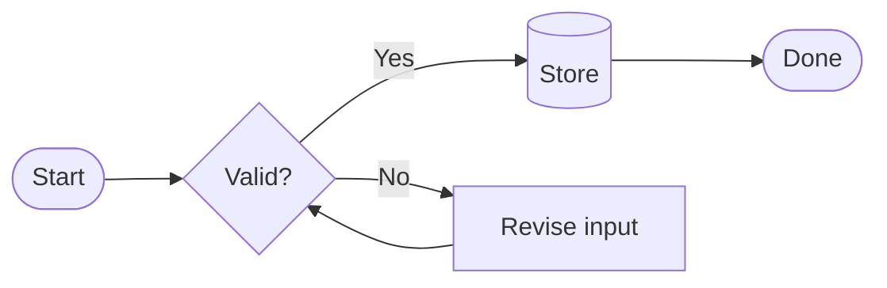
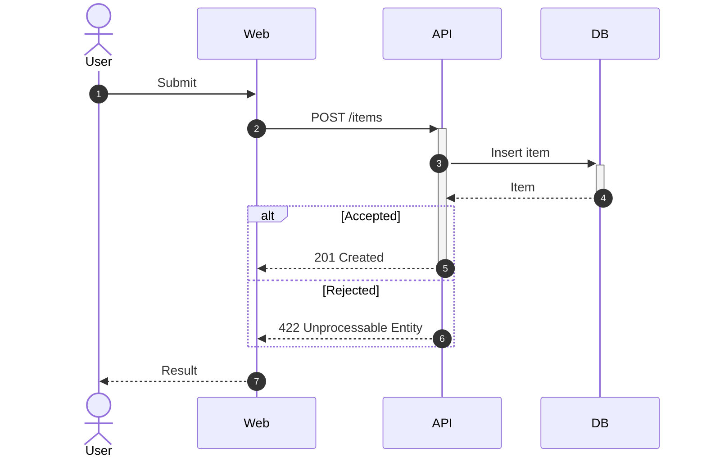
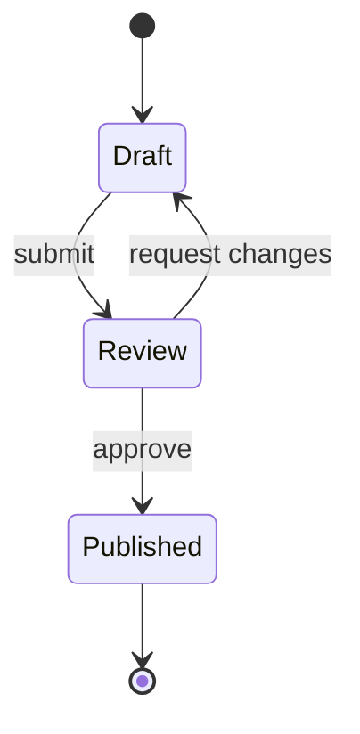
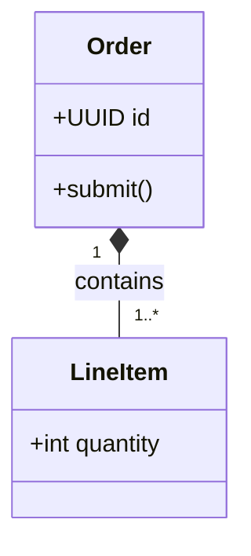
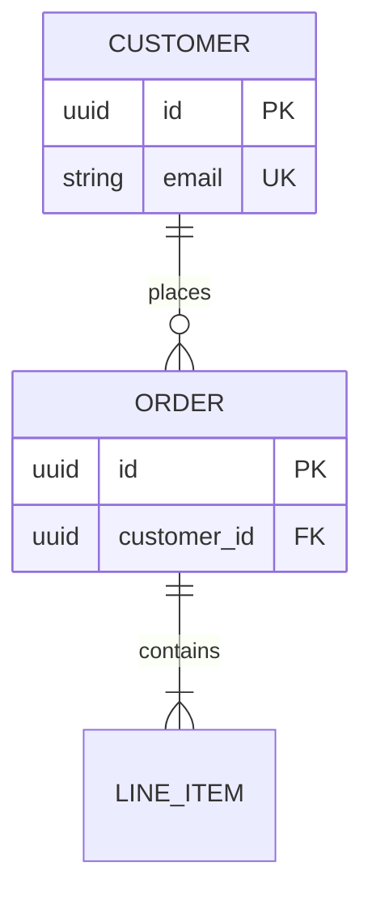
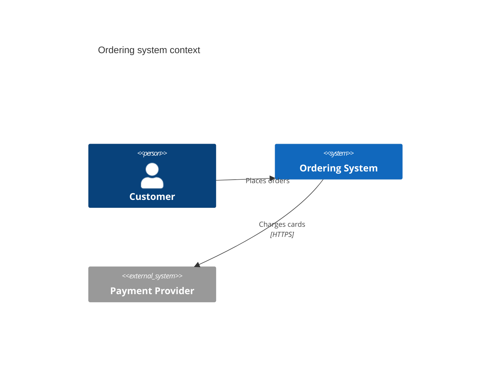
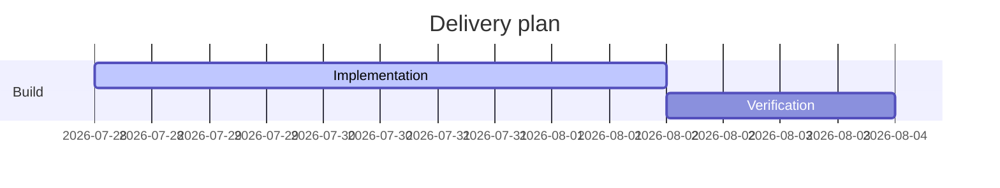
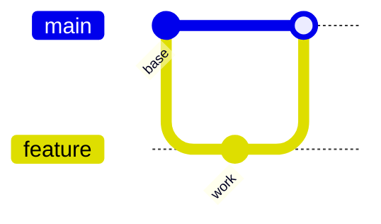

# Mermaid notation and rendering

Use only the section for the selected diagram type. Mermaid features and renderer support evolve; verify current syntax in the [official documentation](https://mermaid.js.org/intro/) when a load-bearing feature is not covered here or the target rejects it.

## Contents

- [Selection](#selection)
- [Shared source rules](#shared-source-rules)
- [Flowchart](#flowchart)
- [Sequence](#sequence)
- [State](#state)
- [Class](#class)
- [Entity relationship](#entity-relationship)
- [C4](#c4)
- [Gantt and Git graph](#gantt-and-git-graph)
- [Rendering evidence](#rendering-evidence)

## Selection

| Relationship to show | Declaration |
| --- | --- |
| Process, decision, pipeline, journey | `flowchart` |
| Messages ordered over time | `sequenceDiagram` |
| Lifecycle and transitions | `stateDiagram-v2` |
| Classes, interfaces, inheritance, composition | `classDiagram` |
| Tables, attributes, and cardinality | `erDiagram` |
| Project schedule | `gantt` |
| Git branch history | `gitGraph` |
| C4 context, container, or component view | `C4Context`, `C4Container`, `C4Component` |
| Cloud or infrastructure topology | `architecture-beta` when the target supports it; otherwise `flowchart` |

Prefer established core syntax over an experimental diagram type when the target renderer is unknown.

## Shared source rules

- The first non-frontmatter line declares the diagram type.
- Use `%%` for source comments.
- Keep identifiers short, unique, stable, and separate from display labels.
- Quote labels containing punctuation that could be parsed as syntax. Use the target renderer's supported entity or quoted-label form for characters that remain ambiguous; do not assume HTML labels are enabled.
- Use one direction per main flow; `LR` and `TB` cover most cases.
- Split large diagrams before adding styling intended to rescue their readability.
- Use styling sparingly and keep meaning redundant with text or shape.

The renderer controls layout. Node order, direction, subgraphs, and selective invisible links may influence it, but coordinates are not a stable contract. When exact placement is load-bearing, choose Excalidraw or draw.io instead of fighting automatic layout.

Use the target's existing theme unless the user requests another one. Theme variables and frontmatter configuration vary by host and security policy; verify them against the actual renderer before relying on custom colors, fonts, icons, HTML labels, links, or interaction.

## Flowchart



Common shapes:

```text
step[Process]
terminal([Start or end])
decision{Decision}
database[(Database)]
subroutine[[Subroutine]]
```

Group a meaningful boundary with `subgraph <id> [<label>] ... end`. Put relationship text on the edge with `-->|Label|`. Use `-.->` only when the dotted distinction has a stated meaning.

## Sequence



Use `actor` for people or external roles and `participant` for system components. `->>` normally represents a call or message; `-->>` a return. Use `alt`/`else`, `opt`, `loop`, and `par` only when they clarify behavior. Activation markers `+` and `-` must remain balanced.

## State



Model valid states and transitions, not a disguised action list. Label transitions with the event or condition. Use composite states only when their internal lifecycle changes the answer.

## Class



Relationship core:

```text
A -- B      association
A *-- B     composition
A o-- B     aggregation
A <|-- B    inheritance
A <|.. B    realization
A ..> B     dependency
```

Show only attributes and methods relevant to the diagram's question. Preserve multiplicity when it carries a business invariant.

## Entity relationship



Cardinality ends combine zero or one (`o|`), exactly one (`||`), zero or many (`o{`), and one or many (`|{`). Model junction entities explicitly when their attributes or constraints matter.

## C4



Use `C4Context` for people and systems, `C4Container` for deployable applications and data stores, and `C4Component` for internals of one container. Keep names consistent across levels. C4 support varies by renderer; fall back to a labelled flowchart with boundaries when the target does not support it.

## Gantt and Git graph





Use these only when schedule or branch history is the actual subject. They are poor substitutes for dependency graphs or general timelines.

## Rendering evidence

The target surface owns compatibility. Prefer, in order:

1. the actual chat, documentation system, or application renderer;
2. the repository's existing Mermaid dependency or validation command;
3. an already available compatible CLI or editor.

Inspect the produced image or live rendering, not only the source. A renderer error blocks completion. A syntactically valid diagram with unreadable layout is still unfinished.

For an editable handoff, retain the Mermaid source even when also exporting SVG, PNG, or PDF. Do not send private diagram content to a public rendering service without authority. If no target-compatible parser and renderer are available, report `DEGRADED` and distinguish source review from rendered proof.
