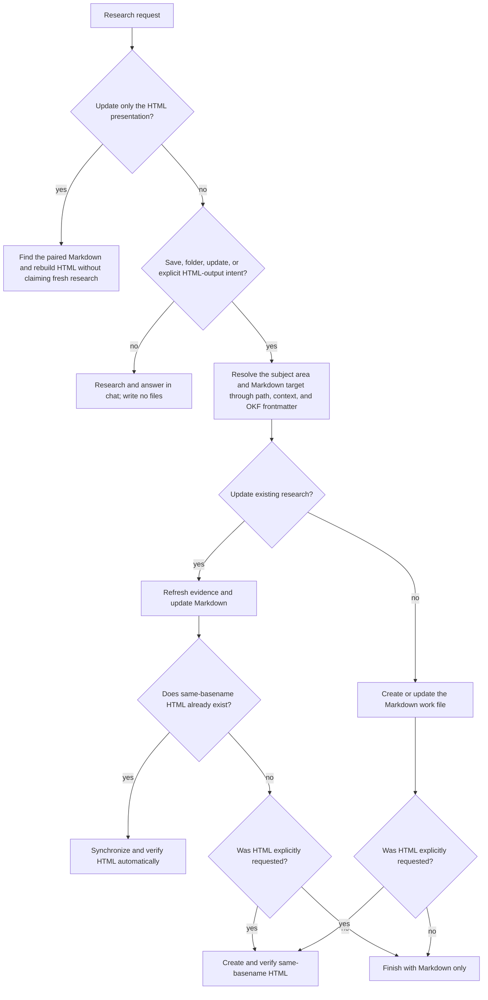

# Research delivery and update modes

Use this reference when a request may create, save, or update research files. Keep format intent separate from the research topic: HTML mentioned as a subject is not an HTML-output request.

## Contents

- [Decision table](#decision-table)
- [Decision flow](#decision-flow)
- [Resolve the research area](#resolve-the-research-area)
- [Use OKF frontmatter for discovery](#use-okf-frontmatter-for-discovery)
- [Create durable research](#create-durable-research)
- [Update existing research](#update-existing-research)
- [Update only the HTML presentation](#update-only-the-html-presentation)
- [Authority and ambiguity](#authority-and-ambiguity)
- [Completion](#completion)

## Decision table

Classify semantic intent, not one exact phrase.

| User intent | Markdown | HTML | Research action |
|---|---:|---:|---|
| «сделай ресерч», «изучи тему», "research this" | no | no | Research and answer in chat |
| «сохрани ресерч», «создай ресерч в папке», "save this research" | create or update | no | Research, then persist the work file |
| «сделай ресерч + html», «сохрани ресерч как HTML» | create or update | create or update | Research, then persist both reader and agent formats |
| «добавь HTML к этому ресерчу» | keep current | create | Build a reader presentation from current Markdown |
| «обнови HTML-версию» | keep current | update | Refresh presentation only; do not claim source research was refreshed |
| «обнови ресерч» | update | update only if already present | Re-research and synchronize existing representations |
| «обнови ресерч + HTML» | update | create or update | Re-research and ensure both formats exist |
| «обнови только Markdown», «HTML не трогай» | update | leave unchanged | Re-research, warn that existing HTML may now be stale |

The words «создай ресерч» without a folder, file, save, update, or output-format cue do not by themselves authorize persistent files. Treat them like a chat research request when context does not make persistence explicit.

## Decision flow

## Resolve the research area

A `docs/research/` folder represents a durable subject or decision area and may contain several independent research questions.

Resolve in this order:

1. an explicit path, basename, or currently referenced research file;
2. the current conversation's clearly identified research pair;
3. OKF frontmatter in existing curated Markdown;
4. folder names, entry-point headings, and close terms in the body;
5. a new dated subject area only when no existing area fits.

One clear match authorizes proceeding. Several plausible matches require one short choice from the user. No match for an update request is not permission to create a new research file: report that the target was not found and ask whether to create it.

## Use OKF frontmatter for discovery

Read the complete YAML frontmatter of candidate curated Markdown files. Prefer:

- `title` for the research question or dossier identity;
- `description` for semantic scope and close formulations;
- `tags` for stable topic matching across vocabulary changes;
- `type` to distinguish a dossier entry point from a research note, analysis, plan, playbook, or reference;
- `timestamp` to judge freshness after identity has been resolved, never as the primary identity key;
- `okf_version` or local extension fields when present, preserving their declared meaning.

An exact current path or same basename is stronger than a semantic match. Frontmatter `title`, `description`, and `tags` are stronger than a coincidental body mention. A broad dossier match selects the folder, not an existing research file; a new question inside that area still receives a new basename.

Follow the repository's allowed OKF types and required fields. Do not invent a type or rewrite valid metadata merely to normalize style. Update `timestamp` after a substantive edit when local rules use it for freshness.

## Create durable research

Before writing:

1. inspect repository rules and existing research areas;
2. resolve the broad subject area;
3. search for an existing file that represents the same question;
4. update that file when it exists instead of creating a duplicate.

For a new question, create a descriptive stable kebab-case Markdown basename inside the selected area. If no area exists, create the repository's normal dated dossier folder and its required OKF entry point before the research note.

Markdown is the agent work file. Choose sections from the work, but preserve the information needed to continue:

- question, scope, status, and freshness;
- current conclusion and calibrated confidence;
- claim ledger and source-of-truth targets;
- opened sources and access dates;
- conflicts, disconfirming searches, and unresolved uncertainty;
- open questions and the next useful retrieval step.

When HTML is also requested, create the same-basename `.html` beside the Markdown file and follow [HTML report rules](html-reports.md).

## Update existing research

«Обнови ресерч» means refresh the underlying evidence, not merely rewrite prose.

1. Resolve one existing Markdown target through current context and OKF metadata.
2. Read its complete contents, related area entry point, update log, and same-basename HTML when present.
3. Re-open volatile or load-bearing sources, search for changed and disconfirming evidence, then update the Markdown conclusion, ledger, freshness, and metadata.
4. If same-basename HTML already exists, update it from the refreshed Markdown and run the complete HTML language, humanization, fact-lock, and render checks.
5. If HTML does not exist and the user did not request it, stop after Markdown. Do not expand scope by creating it.
6. If the user explicitly says «только Markdown» or «HTML не трогай», preserve the HTML and warn that it may now be stale.

If the resolved item is a broad dossier entry point and several research notes live below it, do not update all of them. Identify the specific question from context or ask once.

## Update only the HTML presentation

«Обнови HTML-версию», «пересобери отчёт» or a comparable follow-up updates presentation only:

- require a current Markdown work file as the evidence base;
- do not browse for new facts unless the user also requests a research update;
- do not change Markdown claims merely to fit the presentation;
- rebuild the HTML, then run the HTML-specific language, fact-lock, anchor, responsive, and render checks;
- state the Markdown freshness date so presentation work is not mistaken for refreshed research.

If only a legacy HTML file exists and no evidence-oriented Markdown can be found, do not invent the missing research basis. Ask whether to reconstruct a Markdown work file from fresh research.

## Authority and ambiguity

- Chat-only research never creates local files.
- Save, folder, or update wording authorizes the necessary local Markdown and dossier index/log edits.
- HTML-output wording additionally authorizes the same-basename HTML file.
- None of these modes authorize publishing, uploading, sending, or unrelated repository changes.
- Preserve user-authored files and inspect before overwriting.
- If repository rules explicitly require a conflicting location or file lifecycle, surface the conflict instead of silently violating either contract.
- When the destination or update target remains ambiguous after OKF discovery, ask one short question instead of scattering duplicates.

## Completion

- Chat mode returned a sourced answer and wrote no files.
- Markdown mode created or updated the intended OKF research file and required local index/log metadata.
- HTML mode has a same-basename Markdown evidence file and passed the HTML-specific checks.
- Research update refreshed Markdown evidence and synchronized an already existing HTML presentation unless the user explicitly excluded it.
- HTML-only update states the freshness of its Markdown basis and does not claim new research.
